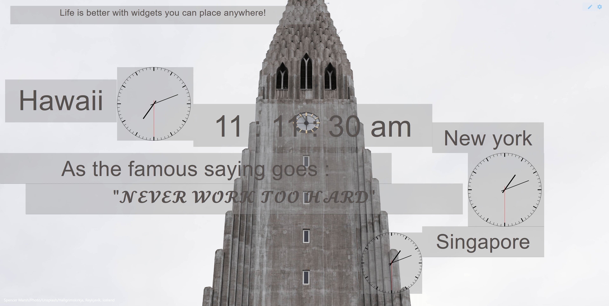

<h1 align="center">BoxTab </h1>

<h3 align="center">A newtab browser plugin with modular and re-arrangeable widgets.</h3>

***

## Usage

1. Install dependencies using `npm install` .
2. Depending on production/development env:
   1. For development `npm start` .
   2. Depending on target browser:
      1. Firefox: `npm run build:firefox` .
      2. Chrome: `npm run build:chrome` .

***

***

***
